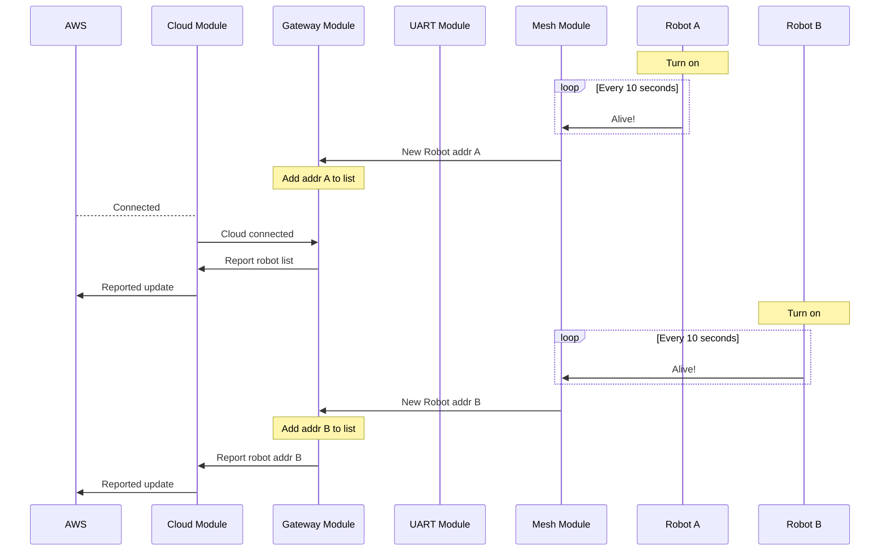
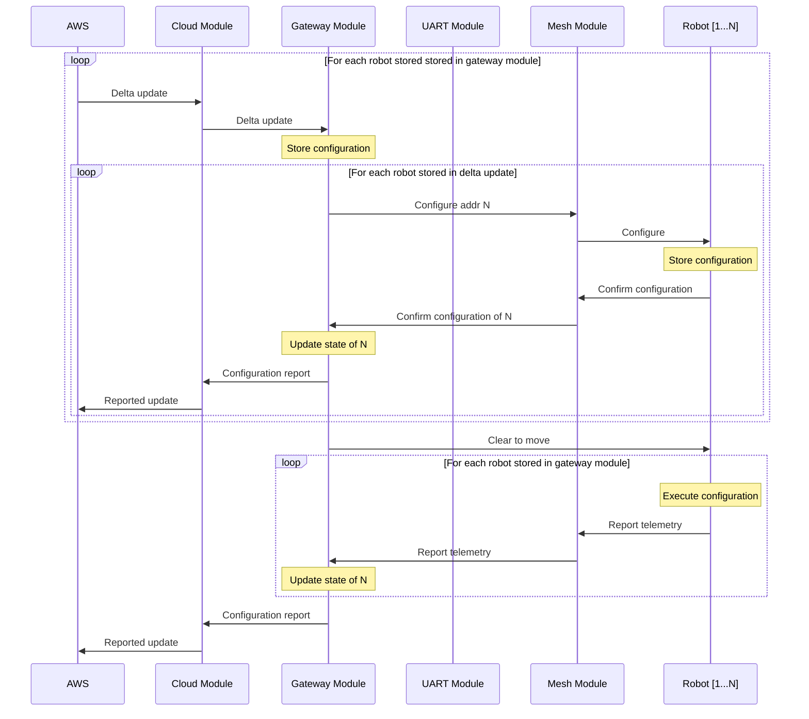
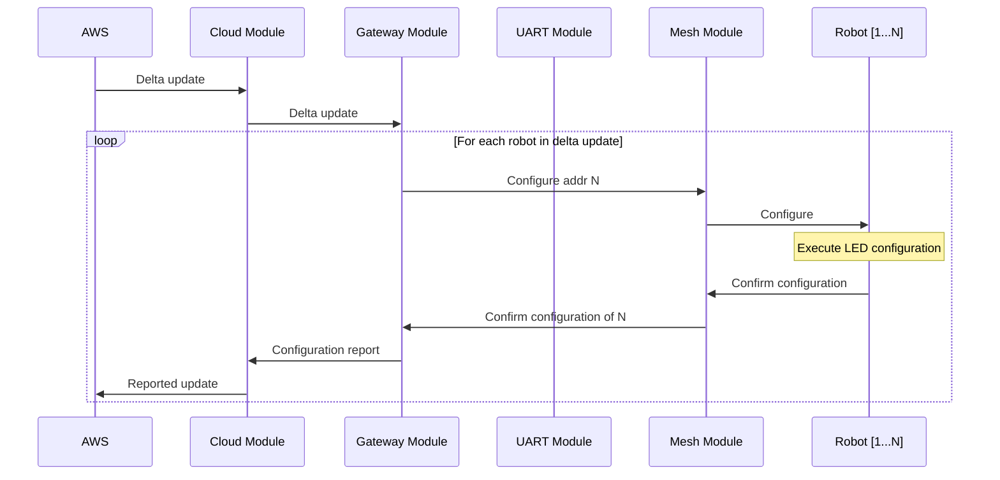

# nRF Robot war firmware modules

## Gateway nRF9160
AWS IoT device. Has two main tasks:
- Receive desired state from the cloud and translate it into robot operations.
- Track and report robot state and operation status.
  
### Modem
- Initiate and manage connection to LTE network.

### Cloud
- Notify gateway about state changes in the cloud.
- Notify cloud about state changes in the gateway.
- Initiate and manage AWS IoT connection.

### Gateway
- Track state of connected robots
- Trigger operations on robots
- Forward status of operations to the cloud
- Cloud payload formatting

### UART
- Ensure healthy state of gateway nRF52840
- Forward operations to gateway nRF52840
- Report messages from gateway nRF52840

## Gateway nRF52840
Acts as BTLE radio for nRF9160.

### UART
- Forward operations to gateway nRF52840 mesh.
- Report messages from mesh to gateway nRF9160.

### Mesh
- Define robot client model
- Initiate radio communication
- Forward operations to robot
- Report status messages from robot
- Listen for new robots

## Robot nRF52840
Controls and individual robot. Handles mesh communication and execution of robot operations.
### Mesh
- Define robot server model
- Initiate radio communication
- Report operations to be executed

### Motor
- Calculate required motor actions
- Actuate motors

# Interface descriptions

## Modem &rarr; Cloud
### Connected
- Notify cloud module that the device is connected to the LTE network.
### Disconnected
- Notify cloud module that the device is disconnected to the LTE network.

## AWS IoT &rarr; Cloud

# Operation descriptions

## Adding robots
The robots will notify their existense every 10 seconds. Everytime the mesh module receives an alive-message from a robot it forwards its address to the gateway module. The gateway creates an entry in a linked list for every new address. When the gateway connects to the cloud it sends a report of the currently stored robots in the list. If the gateway is already connected to the cloud, it reports the newly added robot to the cloud. 

## Configuring movement
Before the robots are configured they need to be added to the gateway and set to the ready state. Movement configuration is initiated by a delta update to the device shadow containing the movement configuration of one or more robots. The configuration data is stored for each robot being configured in the gateway module, and their states are set to configuring state. The gateway forwards the configurations for each configured robot in parallell to the mesh module which further distributes the configurations to the robots. The robots store the configuration and responds with a confirmation. Upon the confirmation message the gateway module sets the state of the robot to configured state. When all robots stored in the gateway are in the configured state it sends the Clear to move event. This event is broadcasted to all robots and they execute their stored configuration. When execution is done, telemetry is reported back to the gateway, wich sets the state of the robot to ready state. When all robots have reported telemetry and are in the ready state, all telemetry is sent to the cloud in a single report.

## Configuring LED
LED configuration may occur at any point in time as long as the robot being configured has been added to the gateway. The configuration is initiated by a delta update from the cloud. The gateway module forwards the configuration for each robot in the delta to the mesh module which further distributes it to the robots. The robots respond with a confirmation when the confugration has been executed. Upon a confirmation the gateway immediately reports the configuration back to the cloud.

